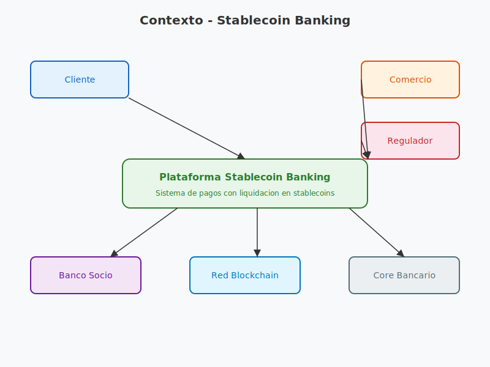
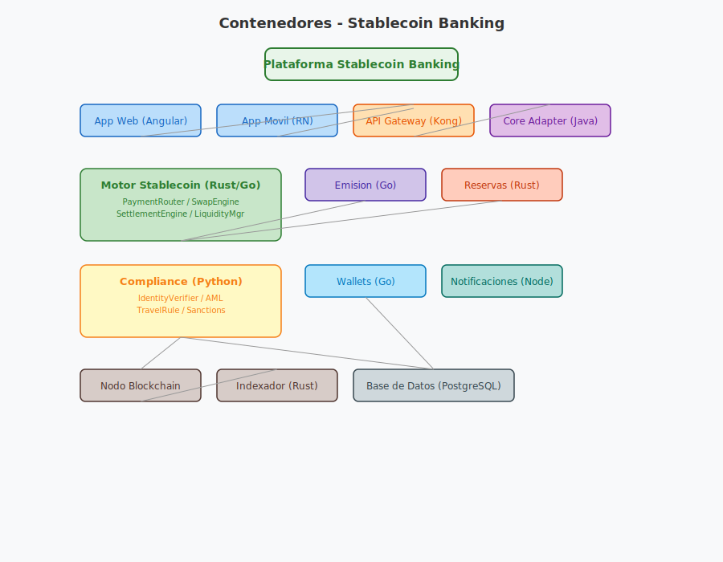
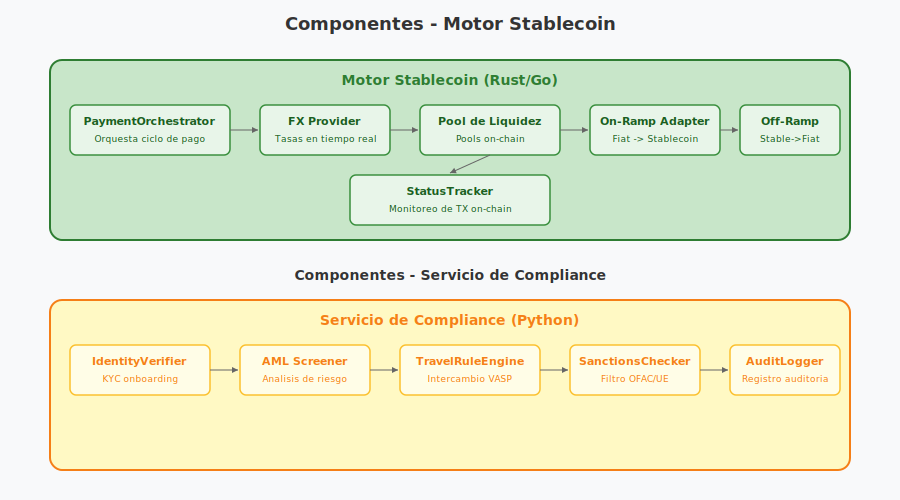

# Documentación de Arquitectura LikeC4

Guía de referencia de los diagramas del proyecto LikeC4 para la plataforma de pagos con stablecoins.

## Diagramas Disponibles

### 1. Diagrama de Contexto
Fuente: [../diagrams/context.c4](../diagrams/context.c4)

### 2. Diagrama de Contenedores
Fuente: [../diagrams/containers.c4](../diagrams/containers.c4)

### 3. Diagrama de Componentes
Fuente: [../diagrams/components.c4](../diagrams/components.c4)

## Patrones Arquitectónicos Aplicados

### Lift-and-Shift (Crypto-Rails, Fiat at the Edges)
Patrón principal del sistema. El usuario envía y recibe moneda fiduciaria sin cambiar su experiencia. La liquidación ocurre mediante stablecoins en blockchain. Los adaptadores On-Ramp y Off-Ramp convierten entre mundos fiat y crypto.

### Process Manager / Saga
El `PaymentOrchestrator` dentro del Motor Stablecoin orquesta una saga de 6 pasos: obtener tasa FX, verificar liquidez, depositar fiat, enviar TX on-chain, monitorear confirmación, retirar a fiat destino. El `SagaLogger` registra cada paso para permitir compensating transactions.

### Anti-Corruption Layer
El `Adaptador Core Bancario` aísla el dominio de stablecoins de los sistemas core legacy (Temenos, SAP), traduciendo protocolos y semánticas entre ambos mundos.

### Ports & Adapters (Hexagonal Architecture)
Cada adaptador en el Motor Stablecoin (`OnRampAdapter`, `OffRampAdapter`, `BlockchainAdapter`, `FX Provider`, `Pool de Liquidez`) es un puerto que encapsula la tecnología externa detrás de una interfaz limpia.

### Event-Driven Architecture
El `Bus de Eventos` (Redis/Kafka) desacopla los servicios mediante topics de dominio y blockchain. El `Indexador On-Chain` publica confirmaciones, el `StatusTracker` las consume, y el `NotificationDispatcher` dispara alertas.

### CQRS (Command Query Responsibility Segregation)
Blockchain actúa como fuente de verdad (event store / write model). PostgreSQL funciona como read model para consultas de estado, contabilidad y reporting.

### Off-chain Compliance + On-chain Audit
La lógica de compliance (KYC, AML, Travel Rule, sanciones) se ejecuta off-chain para rendimiento y flexibilidad. Cada resultado se ancla en blockchain mediante el `AuditLogger` como notario inmutable (on-chain anchor).

### Factory Pattern
`MintController` y `BurnController` implementan el patrón Factory para crear y destruir stablecoins contra reserva 1:1.

## Flujo de Trabajo Recomendado

1. Actualiza el archivo `.c4` correspondiente.
2. Exporta o guarda la imagen equivalente en `images/`.
3. Referencia la imagen desde esta documentación para mantenerla visible.
